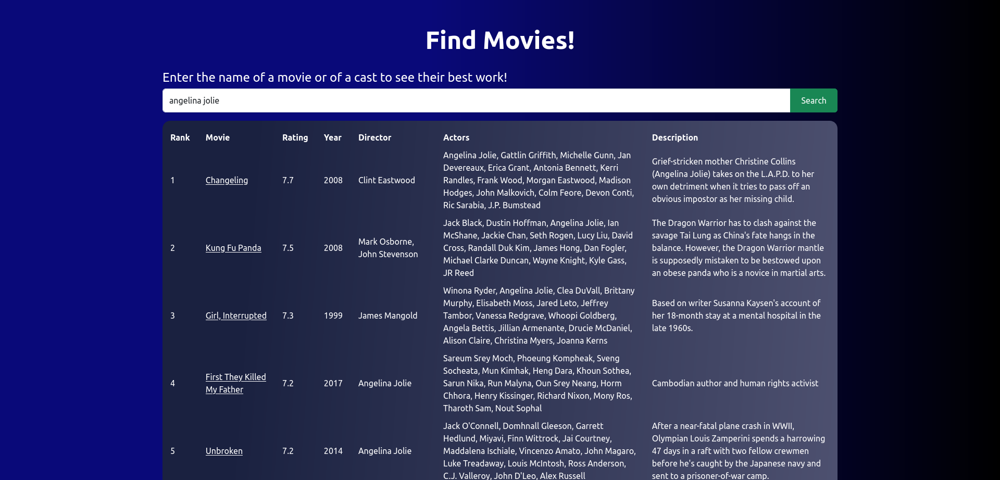
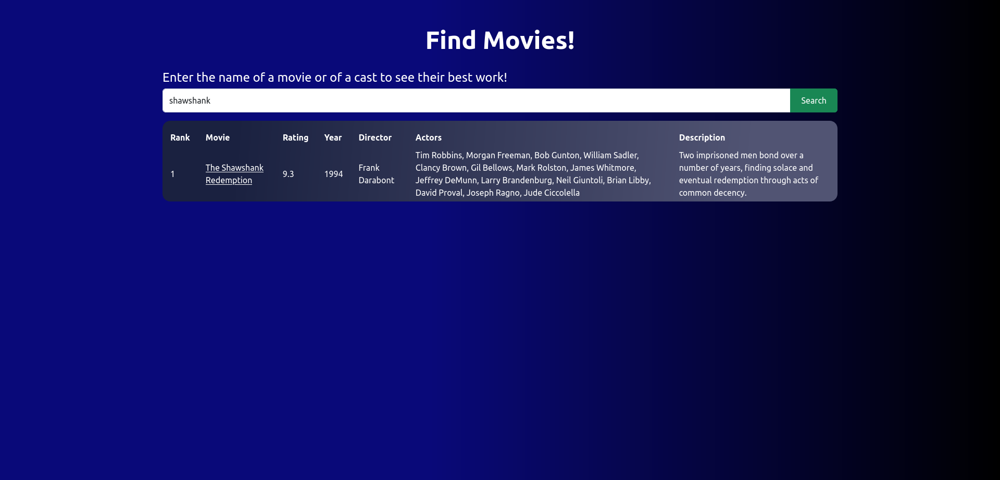
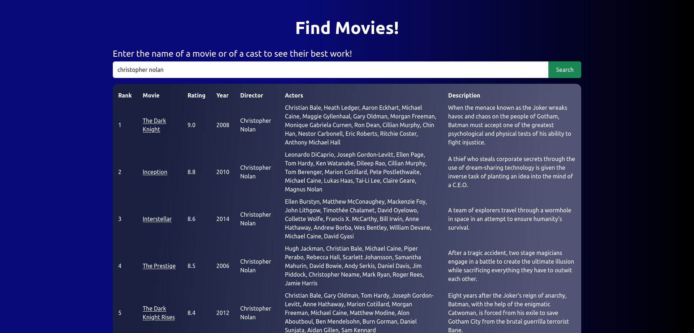

# Movie Search Engine 

## Table of contents

- [Overview](#overview)
    - [Screenshots](#screenshot)
    - [Links](#link)
- [Process](#process)
    - [Built with](#built-with)
    - [Things I Learnt](#things-learnt)
#

## Overview 

### Screenshot

### Link

[Deployment of the current program](https://movies-se.web.app)

## My Process    

### Built with
- HTML
- CSS
    - Bootstrap
- JavaScript
    - [D3JS Library](https://d3js.org/)
    - [Underscore Library](https://underscorejs.org/)

### Things I Learnt

This has been a great hands on experience to learn HTML editing in a JavaScript file using D3 library  

***The database used here (stored in a CSV file) is tad bit old and hence you won't find movies newer than 2020***